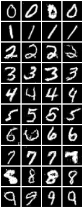
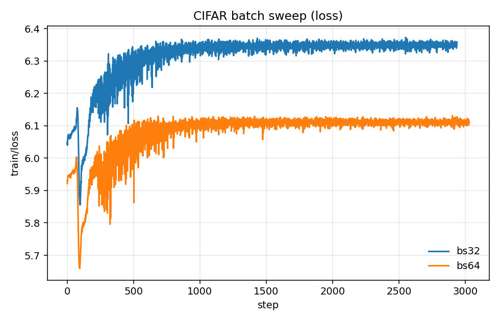
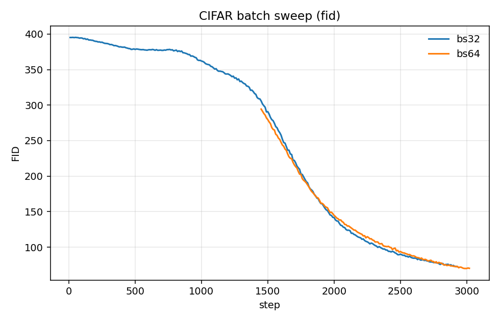
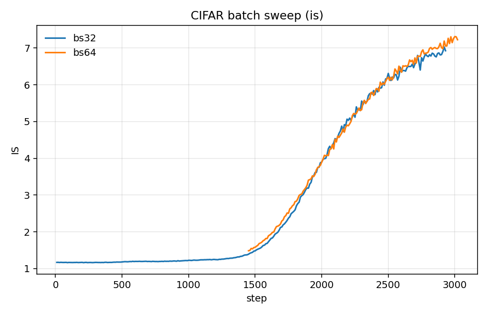
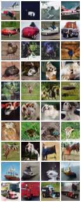
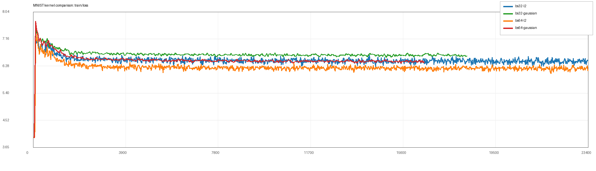
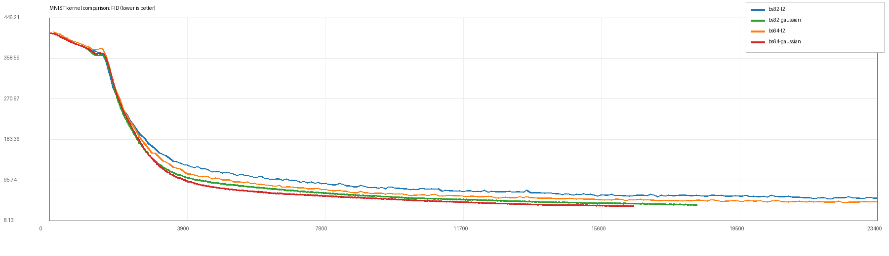
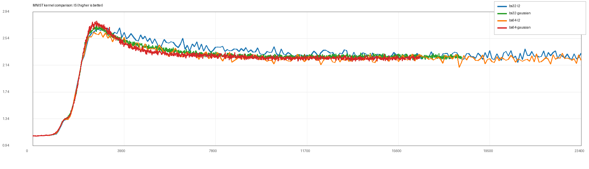

# Experiment report for paper: Generative Modeling via Drifting
We ran preliminary experiments on MNIST and CIFAR with our extended implementation ([repo](https://github.com/jiaxi98/drifting-model)). So far, the results are still far from the paper-level quality, especially on final FID.

## Batch size of positive and negative samples
We tested the effect of Monte Carlo sample size by sweeping `batch_n_pos=batch_n_neg` on MNIST, with all other settings fixed (single seed for now).

W&B runs:
- `bs32`: `t7fdigxh` (`mnist_bs32_0218_130718`)
- `bs64`: `06m370kl` (`mnist_bs64_0218_130738`)
- `bs128`: `7m73idae` (`mnist_bs128_0218_130754`)

| setting | final step | min train/loss | last train/loss | min FID | last FID | max IS | last IS |
|---|---:|---:|---:|---:|---:|---:|---:|
| bs32 | 23400 | 3.9569 | 6.4778 | 54.8681 | 56.2028 | 2.7186 | 2.3179 |
| bs64 | 23400 | 3.9577 | 6.1227 | 47.2951 | 47.9010 | 2.6380 | 2.2178 |
| bs128 | 23400 | 3.9584 | 5.9902 | 45.4389 | 47.6765 | 2.6674 | 2.2047 |

Observations:
- Larger `batch_n_pos/batch_n_neg` improves final FID in this sweep (`56.20 -> 47.90 -> 47.68`).
- `train/loss` reaches a low value early, then rises and plateaus instead of monotonically decreasing.
- IS peaks early and then declines at later training stages.

### Curves + final sample (downloaded from W&B history)
`bs128` run (`7m73idae`), final sample is from step `23000`.

<table>
  <tr>
    <td></td>
    <td></td>
  </tr>
  <tr>
    <td></td>
    <td></td>
  </tr>
</table>

## CIFAR batch-size comparison (two-stage resume)
We ran CIFAR with `batch_n_pos=batch_n_neg` at two settings, each as a two-stage run (stage-2 resumes from stage-1 checkpoint).

W&B runs:
- `bs32` stage-1: `jyqxs8m1` (`cifar_bs32_20260221_004617`)
- `bs32` stage-2 resume: `op6bix6m` (`cifar_bs32_20260221_004617_resume_localdata_20260221_082438`)
- `bs64` stage-1: `fq036xiu` (`cifar_bs64_8gpu_20260221_005550`)
- `bs64` stage-2 resume: `n4408um6` (`cifar_bs64_8gpu_20260221_005550_resume_localdata_20260221_080436`)

For comparison, we merge stage-1 and stage-2 by step index (stage-2 overrides overlapping steps after resume). Values below are from the latest local logs at report update time:

| setting | final step | min train/loss | last train/loss | min FID | last FID | max IS | last IS |
|---|---:|---:|---:|---:|---:|---:|---:|
| bs32 (merged) | 2937 | 5.8557 | 6.3566 | 72.3870 | 72.3870 | 7.0275 | 6.9267 |
| bs64 (merged) | 3029 | 5.6593 | 6.1099 | 69.9139 | 70.1856 | 7.3124 | 7.2267 |

Observations:
- Same as MNIST, `train/loss` is not monotonically decreasing: it rises from an early low value and then plateaus.
- Larger batch (`bs64`) gives better quality than `bs32` in this sweep: lower FID and higher IS.
- `bs64` also converges to a lower loss plateau (`~6.11`) than `bs32` (`~6.36`).
- Note: `bs64` stage-1 did not log FID/IS (FID logging was enabled in stage-2), so quality comparison mainly uses stage-2/merged tails.

### Curves + sample grids
<table>
  <tr>
    <td></td>
    <td></td>
  </tr>
  <tr>
    <td></td>
    <td></td>
  </tr>
</table>

## Kernel choices
We investigate different kernels for drift estimation. The paper uses L2 kernel. We also evaluate Gaussian kernel as an alternative with a stronger theoretical motivation (Fisher-information-related objective under our derivation).

### Implementation
We compare kernels on MNIST with the same training pipeline and two batch settings.

W&B runs:
- `bs32, l2`: `t7fdigxh` (`mnist_bs32_0218_130718`)
- `bs32, gaussian`: `txib4d74` (`mnist_bs32_ep500_fidis10_20260221_054903`)
- `bs64, l2`: `06m370kl` (`mnist_bs64_0218_130738`)
- `bs64, gaussian`: `aiwdupp7` (`mnist_bs64_ep500_fidis10_20260221_054955`)

### L2 kernel
Run-end summary (as logged):

| setting | final step | min train/loss | last train/loss | min FID | last FID | max IS | last IS |
|---|---:|---:|---:|---:|---:|---:|---:|
| bs32 + l2 | 23400 | 3.9569 | 6.4778 | 54.8681 | 56.2028 | 2.7186 | 2.3179 |
| bs64 + l2 | 23400 | 3.9577 | 6.1227 | 47.2951 | 47.9010 | 2.6380 | 2.2178 |

### Gaussian kernel
Run-end summary (as logged):

| setting | final step | min train/loss | last train/loss | min FID | last FID | max IS | last IS |
|---|---:|---:|---:|---:|---:|---:|---:|
| bs32 + gaussian | 18300 | 3.9483 | 6.6025 | 40.6930 | 42.1633 | 2.7617 | 2.2568 |
| bs64 + gaussian | 16500 | 3.9491 | 6.4253 | 38.3410 | 39.2414 | 2.8034 | 2.2595 |

Matched-step snapshot (`step=16000`) to reduce bias from unequal run lengths:

| setting | train/loss @16000 | FID @16000 | IS @16000 |
|---|---:|---:|---:|
| bs32 + l2 | 6.5009 | 62.2722 | 2.2427 |
| bs32 + gaussian | 6.6445 | 45.2923 | 2.2916 |
| bs64 + l2 | 6.2322 | 53.8721 | 2.2191 |
| bs64 + gaussian | 6.4137 | 39.5218 | 2.2613 |

Observations:
- In this MNIST setup, Gaussian kernel consistently improves FID versus L2 for both batch sizes.
- IS is slightly better with Gaussian at matched step, but both kernels still show late-stage IS decline.
- `train/loss` remains non-monotonic and is not a reliable proxy for final sample quality here (Gaussian has better FID but higher loss plateau).

### Curves

## Feature extractor
We believe feature quality is a key factor for drift-model performance. Current reproduction quality is not enough yet; feature extractor choices and alignment with paper settings remain a major open factor.

## Planned next experiments
To better explain the current quality gap, we will run the following three targeted ablations next.

### 1) Kernel normalization ablation (highest priority)
Motivation: the paper (Table 11) studies kernel normalization variants, while our current implementation uses softmax over both `x` and `y` axes by default.

Plan:
- Implement a `y-only` normalization path in `compute_V_from_dists` (normalize only across `y_pos` / `y_neg` samples per generated sample).
- Compare three variants under the same training budget:
  - `x+y` softmax (current default)
  - `y-only` softmax (closer to the original kernel weighting form)
  - no normalization
- Report `train/loss`, FID, IS, and final sample grids.

### 2) Feature encoder family ablation
Motivation: Table 3 and Appendix A.4 indicate feature encoder quality strongly affects final FID.

Plan:
- Keep training config fixed and compare:
  - `resnet18`
  - `resnet50`
  - `convnextv2`
  - `dinov2`
- Track convergence speed, FID/IS trajectory, and final quality.
- Highlight mismatch vs paper settings (paper uses stronger SSL encoders, including MAE-based encoders).

### 3) Feature-space vs pixel-space ablation
Motivation: this may be a major source of the gap to paper-level quality.

Plan:
- Run matched experiments on MNIST/CIFAR with:
  - pixel-space drifting loss
  - feature-space drifting loss
- Keep model, optimizer, and sampling/eval budget fixed.
- Compare loss behavior, FID/IS, and visual quality at matched steps.

### Shared protocol for the three ablations
- Fix dataset split, training steps, eval cadence, and `fid_num_samples`.
- Use the same logging keys and save sample grids at matched steps.
- Prefer at least 2 seeds if compute budget allows; otherwise clearly label single-seed conclusions as preliminary.
