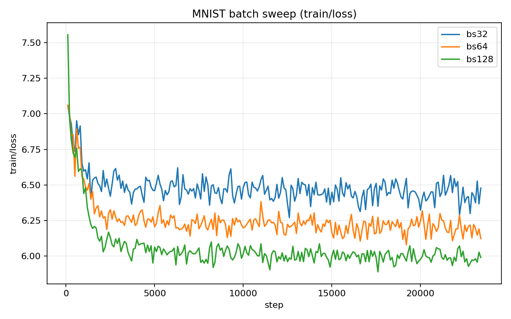
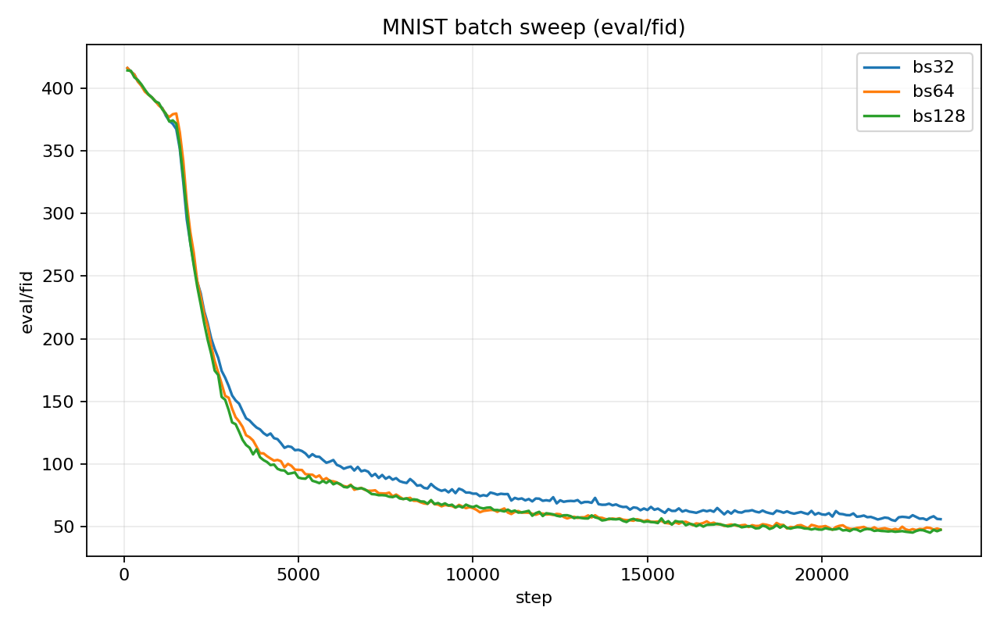
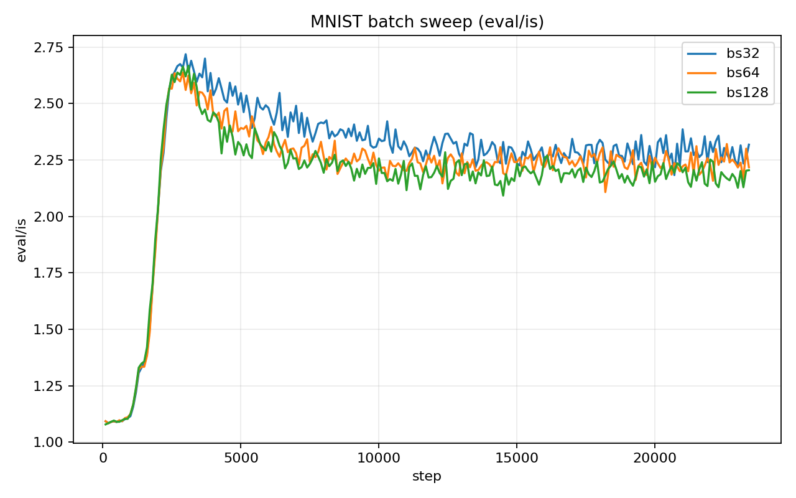

# Experiment report for paper: Generative Modeling via Drifting
We ran preliminary experiments on MNIST and CIFAR with our extended implementation ([repo](https://github.com/jiaxi98/drifting-model)). So far, the results are still far from the paper-level quality, especially on final FID.

## Baseline sanity
Training/sampling/FID/IS pipelines are functional. We can reproduce stable training runs and collect all metrics in W&B, but visual quality and FID remain unsatisfactory.

## Batch size of positive and negative samples
We tested the effect of Monte Carlo sample size by sweeping `batch_n_pos=batch_n_neg` on MNIST, with all other settings fixed (single seed for now).

W&B runs:
- `bs32`: `t7fdigxh` (`mnist_bs32_0218_130718`)
- `bs64`: `06m370kl` (`mnist_bs64_0218_130738`)
- `bs128`: `7m73idae` (`mnist_bs128_0218_130754`)

| setting | final step | min train/loss | last train/loss | min FID | last FID | max IS | last IS |
|---|---:|---:|---:|---:|---:|---:|---:|
| bs32 | 23400 | 3.9569 | 6.4778 | 54.8681 | 56.2028 | 2.7186 | 2.3179 |
| bs64 | 23400 | 3.9577 | 6.1227 | 47.2951 | 47.9010 | 2.6380 | 2.2178 |
| bs128 | 23400 | 3.9584 | 5.9902 | 45.4389 | 47.6765 | 2.6674 | 2.2047 |

Observations:
- Larger `batch_n_pos/batch_n_neg` improves final FID in this sweep (`56.20 -> 47.90 -> 47.68`).
- `train/loss` reaches a low value early, then rises and plateaus instead of monotonically decreasing.
- IS peaks early and then declines at later training stages.

### Curves (downloaded from W&B history)

## Kernel choices
We investigate different kernels for drift estimation. The paper uses L2 kernel. We also evaluate Gaussian kernel as an alternative with a stronger theoretical motivation (Fisher-information-related objective under our derivation).

### Implementation
TBD.

### L2 kernel
TBD.

### Gaussian kernel
TBD.

## Feature extractor
We believe feature quality is a key factor for drift-model performance. Current reproduction quality is not enough yet; feature extractor choices and alignment with paper settings remain a major open factor.
